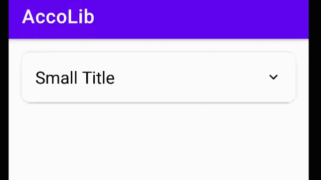

# AccoLib

[]()
[](https://android-arsenal.com/api?level=15)
[](https://jitpack.io/#GouravKhunger/Accolib)


An easy-to-use, amazing Accordion Library for Android built with kotlin.

It reduces the amount of code needed to make Accordions in android, way less
than what was needed before ✨

## Demo


(Animation has improved since `v1.1.0`)

## Requirements
- Android `minSDKVersion` 21

## Usage
Add it in your root build.gradle at the end of repositories
```Groovy
allprojects {
    repositories {
        ...
        maven { url 'https://jitpack.io' }
    }
}
```

Add the dependency
```Groovy
dependencies {
    implementation 'com.github.GouravKhunger:AccoLib:1.1.1'
}
```

## How to use this library
Add the `AccoLib` widget to your xml layout
```xml
<com.gouravkhunger.accolib.widget.Accordion
            android:id="@+id/accordion"
            android:layout_width="wrap_content"
            android:layout_height="wrap_content"
            app:layout_constraintEnd_toEndOf="parent"
            app:layout_constraintStart_toStartOf="parent"
            app:layout_constraintTop_toTopOf="parent"
            app:title="@string/small_title"
            app:text="@string/small_text"
            app:titleSize="18sp"
            app:textSize="16sp"
            app:titleColor="@android:color/black"
            app:textColor="@android:color/darker_gray"/>
```

## Available attributes

Currently, the AccoLib widget supports only these attributes and 
customizations, more functionality to be shipped soon 🚀.

| Name         | Type        | Description                                                             |
|--------------|-------------|-------------------------------------------------------------------------|
| `title`      | `string`    | Title of the accordion.                                                 |
| `text`       | `string`    | Text to be displayed in the accordion.                                  |
| `titleSize`  | `dimension` | Size of the Title(input in any format but is applied as raw pixel)      |
| `textSize`   | `dimension` | Size of the Text(input in any format works but is applied as raw pixel) |
| `titleColor` | `color`     | Color to be applied to the Title of the accordion.                      |
| `textColor`  | `color`     | Color to be applied to the text of the accordion.                       |

# License
```
MIT License

Copyright (c) 2021 Gourav Khunger

Permission is hereby granted, free of charge, to any person obtaining a copy
of this software and associated documentation files (the "Software"), to deal
in the Software without restriction, including without limitation the rights
to use, copy, modify, merge, publish, distribute, sublicense, and/or sell
copies of the Software, and to permit persons to whom the Software is
furnished to do so, subject to the following conditions:

The above copyright notice and this permission notice shall be included in all
copies or substantial portions of the Software.

THE SOFTWARE IS PROVIDED "AS IS", WITHOUT WARRANTY OF ANY KIND, EXPRESS OR
IMPLIED, INCLUDING BUT NOT LIMITED TO THE WARRANTIES OF MERCHANTABILITY,
FITNESS FOR A PARTICULAR PURPOSE AND NONINFRINGEMENT. IN NO EVENT SHALL THE
AUTHORS OR COPYRIGHT HOLDERS BE LIABLE FOR ANY CLAIM, DAMAGES OR OTHER
LIABILITY, WHETHER IN AN ACTION OF CONTRACT, TORT OR OTHERWISE, ARISING FROM,
OUT OF OR IN CONNECTION WITH THE SOFTWARE OR THE USE OR OTHER DEALINGS IN THE
SOFTWARE.
```
